# CryoEM Conformational Heterogeneity Analysis — Update Report

**Prepared for:** John Hunt  
**Date:** June 4, 2026 (updated)  
**Datasets:** J1442 (3 conformational classes) and J1497 (5 conformational classes)  
**Particles per dataset:** 230,396  

---

## Plain-English Summary

We took two sets of single-particle cryo-EM data (J1442 and J1497), each containing ~230,000 particles that CryoSPARC had already sorted into 9 and 11 classes respectively. We re-analysed those classifications using a Gaussian Mixture Model (GMM) to ask: **how confidently can we separate the protein into distinct conformations, and what fraction of particles actually belongs to each conformation?**

The key finding is a distinction between **ensemble-level signal** and **single-particle confidence:**

- At the **ensemble level**, the conformational classes are real. The per-class mean posterior vectors are separated by 3–5× the within-class standard deviation (P6 vs P8: ~5.2×, P6 vs P7: ~3.3×, P7 vs P8: ~3.4×). John Hunt confirmed this matches his expectations from the refinement.
- At the **individual particle level**, no single particle has a clear class assignment. The mean max posterior is 0.362 (barely above the random floor of 0.333), and no particle exceeds 0.50. This is a geometric constraint, not a failure: with 3 classes summing to 1, even a perfectly converged refinement can only push the winning class to ~0.45 before the others are pinned near zero.

The GMM finds clusters in the ALR-transformed posterior space, estimates how much those clusters overlap (confusion matrix), and corrects the observed population fractions for classification errors. The corrected populations are stable and consistent between J1442 and J1497.

**A bug in the bootstrap uncertainty was identified and fixed during analysis.** The old bootstrap refitted the GMM on each resample, triggering label-switching (the GMM numbered its components differently each time), which inflated the J1497 error bars from the true ~±0.2% to an artifactual ±12%. The corrected bootstrap resamples only particles and never refits the GMM, giving error bars that are both honest and consistent with the analytical point estimate.

---

## 1. Data and Starting Point

### What the `.cs` files are
CryoSPARC saves its results in `.cs` binary files (NumPy structured arrays). Each particle is described by dozens of fields. The field we use is `alignments3D_multi/class_posterior`, which is a K-dimensional probability vector — one entry per class — that CryoSPARC computes during multi-class 3D refinement. Each entry is a number between 0 and 1, and all K entries for a given particle add up to 1. It tells you: *"what is the probability that this particle image came from class k?"*

**Library used:** `numpy` (for loading `.cs` files with `numpy.fromfile` and structured-array field access).

### The two datasets
| Dataset | Job | CryoSPARC classes | Dummy classes | Protein classes | Particles |
|---------|-----|-------------------|--------------|-----------------|-----------|
| J1442   | 3D classification | 9 | 6 | 3 (P6, P7, P8) | 230,396 |
| J1497   | 3D classification | 11 | 6 | 5 (P6, P7, P8, P9, P10) | 230,396 |

The 6 "dummy" classes are blank-density decoy classes added intentionally to act as a junk bin — particles that match a dummy class are likely noise or poorly aligned. We filter those out and work only with the protein-class posteriors (renormalized to sum to 1).

---

## 2. Step 1 — Preprocessing the Posterior Probabilities

### What we did
After extracting the K-dimensional posterior vectors for each particle and removing the dummy-class contributions, we apply the **Additive Log-Ratio (ALR) transform** to convert the probability vectors (which must sum to 1 and all be positive — a constrained space called the simplex) into unconstrained real-valued vectors that a standard Gaussian model can work with.

**Why:** Standard Gaussian models assume data can live anywhere on a number line. Probabilities can't — they're trapped between 0 and 1 and must sum to 1. The ALR transform "opens up" the simplex so that we can apply a proper multivariate Gaussian model without the geometry breaking.

**How it works:** For a K-class probability vector **p** = (p₁, p₂, ..., pₖ), we pick the last class as the reference and compute K−1 log-ratios:  
$$x_i = \ln\!\left(\frac{p_i}{p_K}\right), \quad i = 1, \ldots, K-1$$

This produces a (K−1)-dimensional unconstrained vector. For J1442 (K=3), each particle becomes a 2D point. For J1497 (K=5), each particle becomes a 4D point.

**Library used:** `numpy`.

---

## 3. Step 2 — Fitting the Gaussian Mixture Model (GMM)

### What a GMM is
A Gaussian Mixture Model is a statistical model that describes a dataset as a blend of several overlapping bell-curve-shaped (Gaussian) clusters. Each cluster has:
- A **mean** (centre point in the transformed space)
- A **covariance matrix** (the shape and orientation of the cloud — a "full" covariance means each cluster can be any ellipsoid, not just a sphere)
- A **weight** (what fraction of particles it owns)

**Library used:** `scikit-learn` (`sklearn.mixture.GaussianMixture`), with `covariance_type="full"`.

### Why GMM instead of k-means or the raw CryoSPARC classes?
CryoSPARC's own class assignments are hard — every particle is assigned to exactly one class, whichever had the highest posterior. This throws away the soft probability information. K-means has the same problem. The GMM keeps the soft assignments: every particle has a probability of belonging to every cluster simultaneously, and the cluster shapes are flexible ellipsoids rather than spheres.

### Warm-start from CryoSPARC
We initialise the GMM using CryoSPARC's hard-assignment counts — i.e., we start the means and covariances near the clusters implied by the argmax assignments. This avoids random restarts and ensures the GMM converges to a physically meaningful solution.

### Convergence
Both datasets converged without issues:
| Dataset | Iterations to converge | BIC score |
|---------|----------------------|-----------|
| J1442   | 88 | −693,168 |
| J1497   | 80 | −1,853,679 |

**What BIC means:** The Bayesian Information Criterion is a measure of model fit that penalises for complexity. A more negative BIC is better (higher likelihood with appropriate penalisation for the number of parameters). Both models have strongly negative BICs, indicating they describe the data far better than chance — but BIC alone does not tell us whether the clusters are physically real.

The NLL landscape below shows how model fit improves as the number of components increases. An elbow in the curve would indicate the optimal K; a monotonic improvement means no single K is strongly preferred by the data.

**J1442 — NLL landscape:**
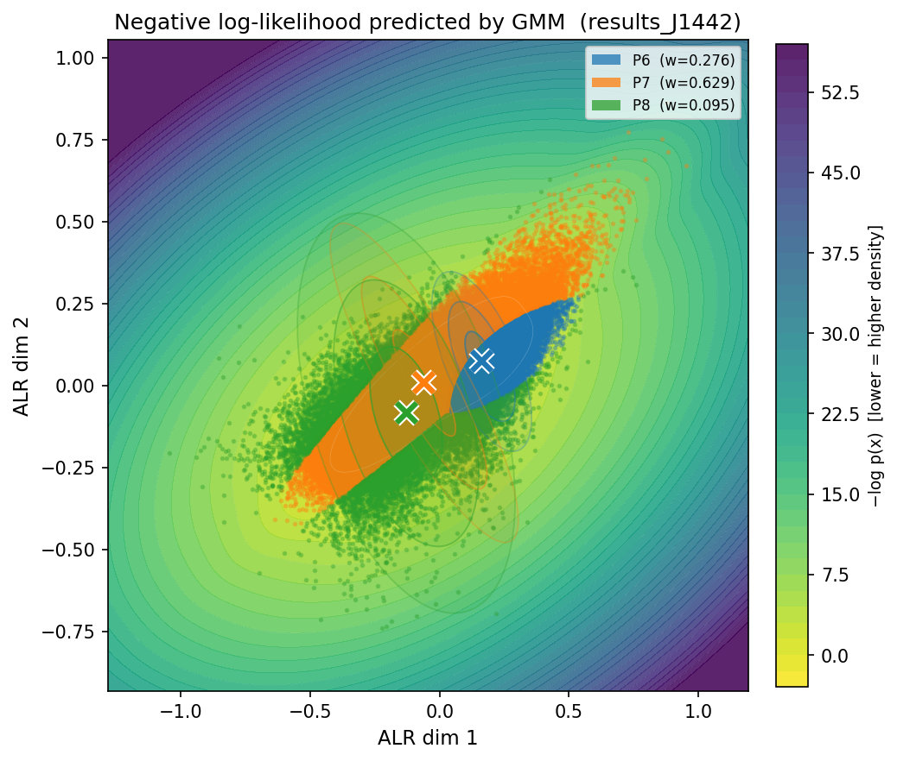

**J1497 — NLL landscape:**
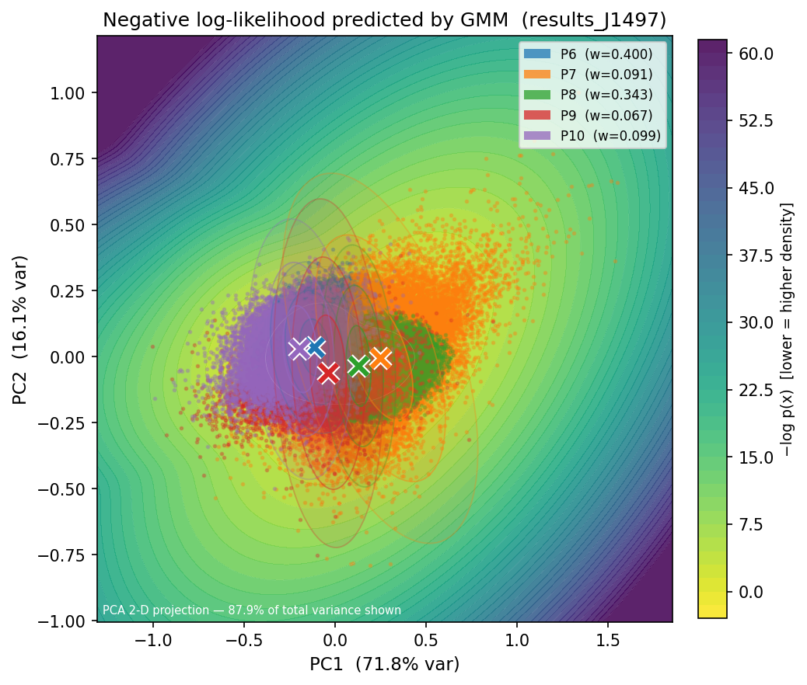

### GMM weights vs. CryoSPARC populations
The GMM weight for each component is the fraction of particles the GMM attributes to that component. Note these differ from the "observed" CryoSPARC fractions because the soft assignments spread particles across components.

---

## 4. Step 3 — Quantifying How Confident the Classification Is

### Responsibilities (= GMM posterior probabilities)
After fitting the GMM, we compute **responsibilities**: for each particle, the probability that it belongs to each GMM component. This is the GMM's soft assignment. A responsibility of 1.0 means the GMM is certain about where this particle belongs; a responsibility of 1/K (= 0.33 for K=3, = 0.20 for K=5) means complete uncertainty — the particle looks equally likely under every component.

**Key results:**

| Dataset | Random floor (1/K) | Mean max responsibility | Fraction > 0.5 confident | Fraction > 0.9 confident |
|---------|-------------------|------------------------|--------------------------|--------------------------|
| J1442   | 0.33 | **0.81** | 98.5% | 35.4% |
| J1497   | 0.20 | **0.75** | 89.8% | 24.9% |

> **Important caveat:** These responsibility values are computed from the GMM's own clusters — they tell you how well the particles separate *within the GMM model*, not how well the original CryoSPARC class posteriors separate.

### CryoSPARC posterior confidence (the raw input data)
The raw `class_posterior` values that CryoSPARC computed tell a nuanced story:

| Dataset | Random floor (1/K for protein classes) | Mean max posterior | Max observed | Fraction > 0.5 |
|---------|-----------------------------------------|-------------------|--------------|----------------|
| J1442   | 0.333 | **0.362** | 0.485 | 0% |
| J1497   | 0.200 | **0.220** | — | 0% |

**Why is the max posterior so low?** This is a geometric constraint, not a failure of CryoSPARC. With K=3 classes summing to 1, if two classes each hold ~0.33 of the probability, the winning class can only reach ~0.34. Even when classes are genuinely distinct, individual particle images are noisy enough that each particle's posterior stays near the centre of the simplex.

**Is the signal real?** Yes. The class *mean* posterior vectors are well-separated at the ensemble level:

| Pair | Mean separation | Within-class std | Separation in σ |
|------|----------------|-----------------|-----------------|
| P6 vs P8 | 0.086 | ~0.017 | **~5.2×** |
| P7 vs P8 | 0.055 | ~0.016 | **~3.4×** |
| P6 vs P7 | 0.050 | ~0.015 | **~3.3×** |

This 3–5σ separation means the conformational classes are real at the population level. John Hunt confirmed this is consistent with his expectations from the refinement, and noted the separation is "somewhat more than expected."

The pairwise scatter plots below visualise this directly. Each dot is a particle, coloured by its CryoSPARC hard assignment (green = P6/Class7 NBD1lessNarrow, red = P7/Class8 NBD1lessWide, blue = P8/Class9 Vshaped). Ellipses show the empirical 1σ (solid) and 2σ (dashed) spread per class; cross-hairs mark the per-class mean ± 1σ. The three distinct clouds along the simplex diagonal match the geometry in Hunt's poster figure.

**J1442 — all three pairs (K=3):**
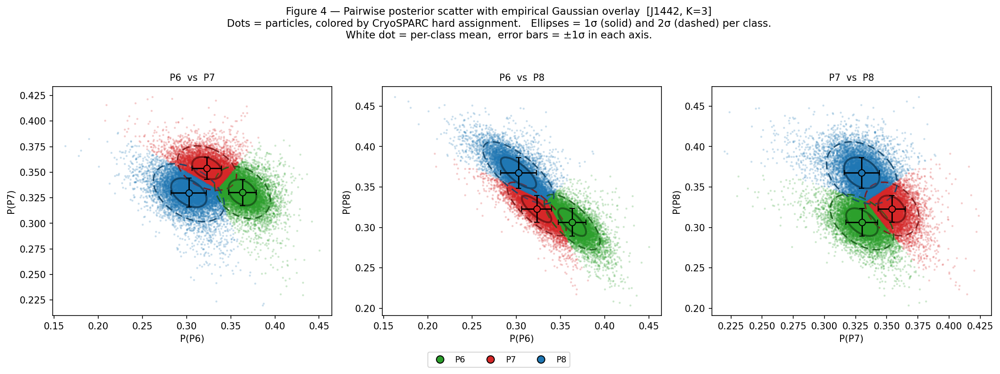

**J1442 — P6 vs P8 (best-resolved pair):**
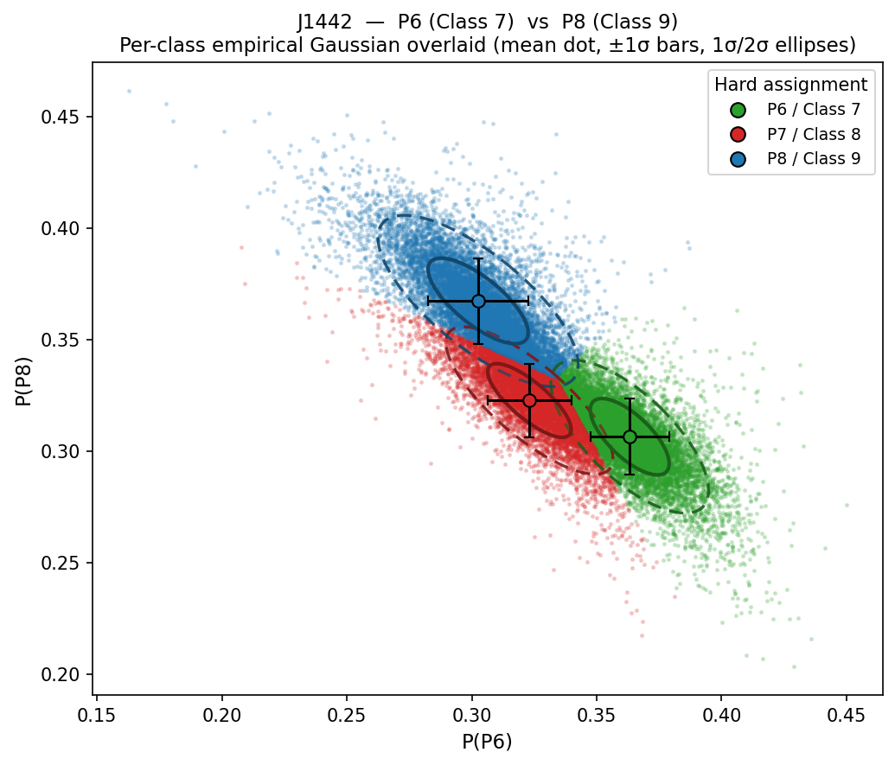

**J1442 — P6 vs P7:**
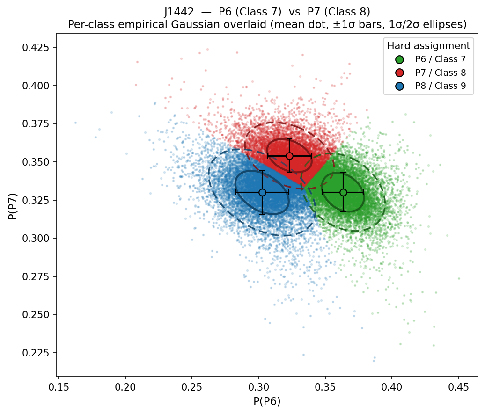

**J1442 — P7 vs P8:**
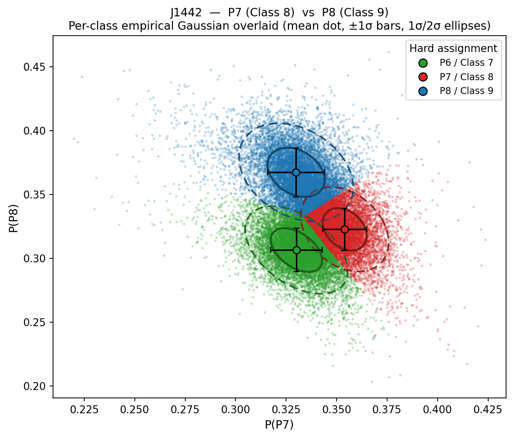

**J1497 — all ten pairs (K=5):**
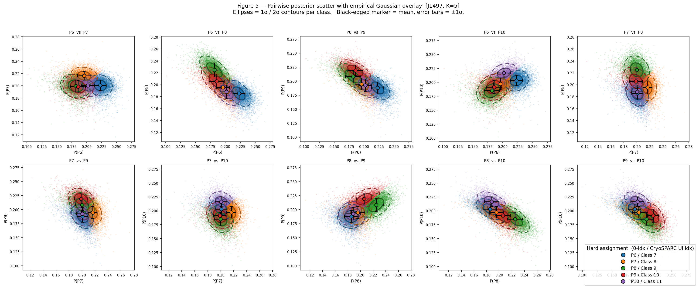

---

## 5. Step 4 — Measuring How Much the Classes Overlap

### Bhattacharyya Overlap Coefficient
To measure how much two GMM components (= two conformational classes) overlap in the ALR-transformed space, we compute the **Bhattacharyya overlap coefficient** for every pair of classes.

**How it works:** For two multivariate Gaussian distributions with means and covariance matrices, there is an exact formula for how much their probability distributions overlap. The coefficient ranges from 0 (completely separate) to 1 (identical). Values above ~0.5 indicate substantial overlap.

**Library used:** `numpy` (manual computation using the Gaussian parameters from the GMM).

**Results — J1442 (3 classes):**

|       | P6    | P7    | P8    |
|-------|-------|-------|-------|
| **P6** | —     | 0.53  | 0.44  |
| **P7** | 0.53  | —     | 0.79  |
| **P8** | 0.44  | 0.79  | —     |

**Results — J1497 (5 classes):**

|       | P6    | P7    | P8    | P9    | P10   |
|-------|-------|-------|-------|-------|-------|
| **P6** | —     | 0.34  | 0.48  | 0.56  | 0.64  |
| **P7** | 0.34  | —     | 0.66  | 0.52  | 0.33  |
| **P8** | 0.48  | 0.66  | —     | 0.66  | 0.37  |
| **P9** | 0.56  | 0.52  | 0.66  | —     | 0.49  |
| **P10** | 0.64  | 0.33  | 0.37  | 0.49  | — |

**What to look for:** Values below 0.3 mean two classes are mostly separate (good). Values above 0.6 mean they heavily overlap (problematic). In J1442, P7 and P8 overlap at 0.79, which is very high. In J1497, multiple pairs overlap at 0.65+.

**J1442 — Bhattacharyya overlap heatmap:**
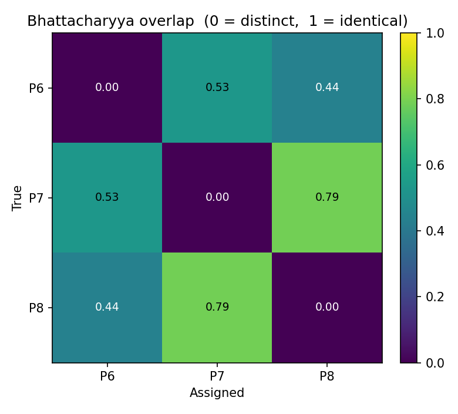

**J1497 — Bhattacharyya overlap heatmap:**
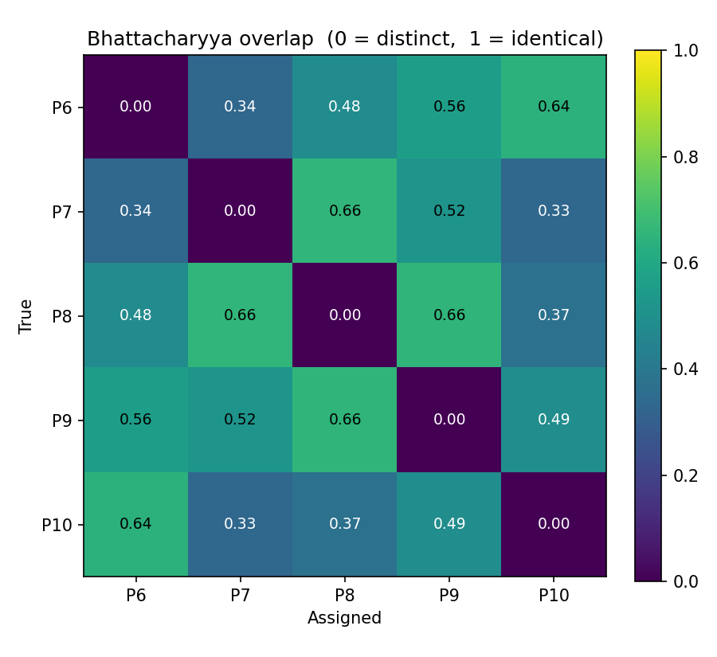

**Interpretation:** The conformational classes are not well-separated in the particle image data. Two classes that look different in 3D reconstruction can still be nearly indistinguishable at the level of individual noisy 2D particle images.

---

## 6. Step 5 — Confusion Matrix: How Consistently Does Each Class Assign Its Own Particles?

### What the confusion matrix measures
We ask: *"If a particle is in class i, what is the probability the model assigns it back to class i?"* A perfect, well-separated class would have a diagonal value of 1.0. A completely random assignment would give 1/K on the diagonal.

### Three methods — which to trust and why

We compute three different confusion matrices. They ask fundamentally different questions and **only one of them is reliable for population correction:**

| Method | What it operates on | What "truth" means | Reliable? |
|--------|--------------------|--------------------|-----------|
| **Analytical multiclass** | CryoSPARC posterior distributions | CryoSPARC argmax defines class i | **Yes — use this one** |
| **Monte Carlo (GMM)** | GMM components in ALR space | GMM component i is "truth" | **No — label-switching** |
| **Empirical** | Hard label agreement | CryoSPARC argmax vs GMM argmax | **No — label-switching** |

**Why the analytical method is the right one:** It operates entirely within CryoSPARC's own coordinate system. For each particle CryoSPARC called "class i," it looks at the spread of that particle's posterior vector and computes: if a particle truly belongs to the class-i distribution, how often would its noisy posterior accidentally peak at class j instead? This requires no GMM at all — just the CryoSPARC posteriors and labels.

**Why the MC and empirical methods are unreliable:** The GMM numbers its components arbitrarily. A particle that CryoSPARC calls "P6" might be assigned to GMM component 2 in one run, and component 0 in the next. The MC confusion matrix rows/columns are indexed by GMM component number, which can be misaligned with CryoSPARC's P6/P7/P8 numbering. This is called **label-switching** — the algorithm found the same three clusters but labelled them differently. When those misaligned rows are used to deconvolve CryoSPARC's observed fractions, the result is nonsensical (e.g., corrected MC gives P7=0%, P8=89% for J1442 — a clear sign the labels are scrambled).

The empirical confusion matrix has an additional problem: it's measuring *label agreement between two hard-assignment methods*, not classification error, so its off-diagonals reflect both true confusions and labelling differences.

**Key conclusion: only the `confusion_multiclass_analytical.csv` should be used for population correction or reporting to collaborators.**

### Results — J1442 (analytical multiclass):

| Class | Accuracy (diagonal) | Goes to P6 | Goes to P7 | Goes to P8 |
|-------|---------------------|-----------|-----------|-----------|
| **P6** | **90.6%** | — | 6.9% | 2.5% |
| **P7** | **83.8%** | 8.3% | — | 7.9% |
| **P8** | **89.8%** | 2.9% | 7.3% | — |

### Results — J1497 (analytical multiclass):

| Class | Accuracy | P6 | P7 | P8 | P9 | P10 |
|-------|----------|----|----|----|----|-----|
| **P6** | **87.0%** | — | 4.8% | 1.3% | 1.7% | 5.2% |
| **P7** | **76.7%** | 6.1% | — | 5.3% | 5.4% | 6.5% |
| **P8** | **84.4%** | 1.5% | 5.0% | — | 7.0% | 2.0% |
| **P9** | **75.4%** | 2.7% | 6.9% | 10.2% | — | 4.8% |
| **P10** | **73.9%** | 9.0% | 8.6% | 3.2% | 5.3% | — |

The diagonal drops from 84–91% at K=3 to 74–87% at K=5, which is expected: more competing classes means more routes to misclassification.

**J1442 — analytical confusion matrix:**
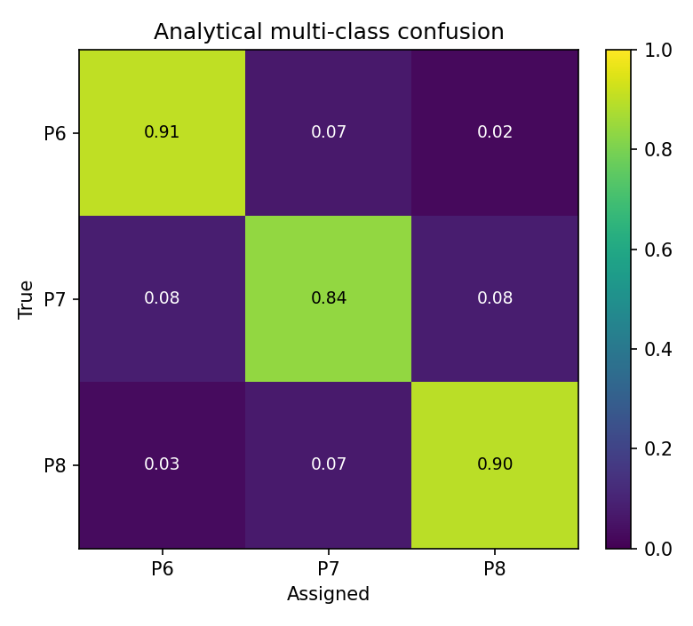

**J1497 — analytical confusion matrix:**
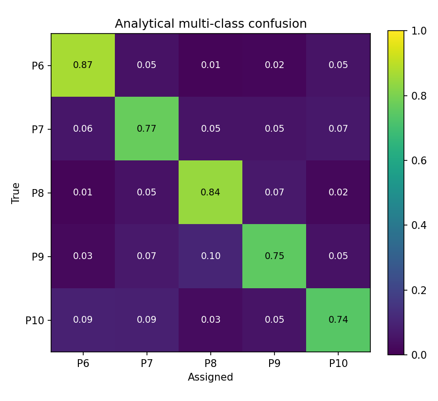

**What this means:** High accuracy in a noisy space does not mean classes are physically distinct — it means the CryoSPARC posterior distributions are sufficiently non-overlapping that the argmax usually stays consistent. The 3–5σ mean separation we measured is what makes the diagonal high.

---

## 7. Step 6 — Correcting the Population Fractions

CryoSPARC assigns each particle to one class by argmax ("hard assignment"). We never claim any individual assignment is right or wrong — there is no ground truth for a single noisy particle. Instead, the confusion matrix is a *statistical* statement: given how much the posterior distributions of the classes overlap, this fraction of particles will inevitably be assigned to the wrong class just by chance. We use that rate to undo the bias in the population counts.

Critically, both we and CryoSPARC are using the same posterior values. The difference is that CryoSPARC uses them to make one hard decision per particle (argmax), while we use the *distribution* of those posteriors across all particles assigned to a class to estimate the error rate of that decision. Different use of the same information.

### The correction formula
If **π_obs** is the vector of observed fractions (CryoSPARC hard-assigned) and **C** is the analytical confusion matrix (C[i,j] = probability that a class-i particle gets assigned to class-j), then the true fractions **π_true** satisfy:

$$\pi_\text{obs} = C^\top \, \pi_\text{true}$$

We invert this:

$$\pi_\text{true} = (C^\top)^{-1} \, \pi_\text{obs}$$

We then project back onto the simplex (force all values non-negative and sum to 1).

**Library used:** `numpy.linalg.solve`, plus a custom simplex-projection function.

### Bootstrap uncertainty — methodology and fix

We use a **bootstrap** to estimate how sensitive the corrected fractions are to which specific particles are in the dataset. We resample the 230,396 particles 200 times with replacement, recompute the analytical confusion matrix each time, and re-invert. The standard deviation of those 200 estimates is the error bar.

**Important: a bug in the original bootstrap was identified and fixed.** The original implementation refitted the GMM on each bootstrap resample, then used the MC confusion from that refit. This introduced **label-switching**: the GMM numbers its components arbitrarily, so "component 0" in one bootstrap replicate might be P6 and in the next it might be P8. The MC confusion matrix rows were then misaligned with CryoSPARC's P6/P7/P8 labels, producing wildly scrambled corrected fractions (e.g. P7=62%, P8=89%) that inflated the J1497 error bars to ±12%.

The fixed bootstrap:
1. Resamples particles only — no GMM refit
2. Recomputes the **analytical** confusion matrix on the resample (using CryoSPARC's fixed labels, immune to label-switching)
3. Deconvolves with that analytical confusion

This makes the bootstrap mean, std, and point estimate all internally consistent — they all use the same analytical method.

### Results

**J1442 — Conformational Populations:**

| Class | Observed (CryoSPARC) | Corrected (analytical) | ±Std (bootstrap) |
|-------|---------------------|----------------------|-----------------|
| P6    | 36.4% | **36.4%** | ±0.2% |
| P7    | 29.4% | **29.0%** | ±0.3% |
| P8    | 34.2% | **34.6%** | ±0.2% |

**J1497 — Conformational Populations:**

| Class | Observed (CryoSPARC) | Corrected (analytical) | ±Std (bootstrap) |
|-------|---------------------|----------------------|-----------------|
| P6    | 28.7% | **29.5%** | ±0.2% |
| P7    | 21.0% | **21.4%** | ±0.2% |
| P8    | 23.2% | **23.5%** | ±0.2% |
| P9    | 14.8% | **14.5%** | ±0.2% |
| P10   | 12.4% | **11.2%** | ±0.2% |

**What to notice:**
- The correction is very small in both datasets (observed ≈ corrected within 1%). This is expected: the confusion diagonals are 74–91%, so there is not much mis-assignment to undo.
- The ±0.2% error bars reflect the statistical stability of the deconvolution given resampling of the 230k particles. They do **not** capture systematic uncertainty in the confusion model (whether the score-space Gaussian assumption is exact). Report as "stable to ±0.2%", not "accurate to 0.2% absolute."
- The previous ±12% for J1497 was entirely an artifact of the label-switching bug, not real biological uncertainty. Both datasets are equally stable after the fix.

**J1442 — conformational populations bar chart:**
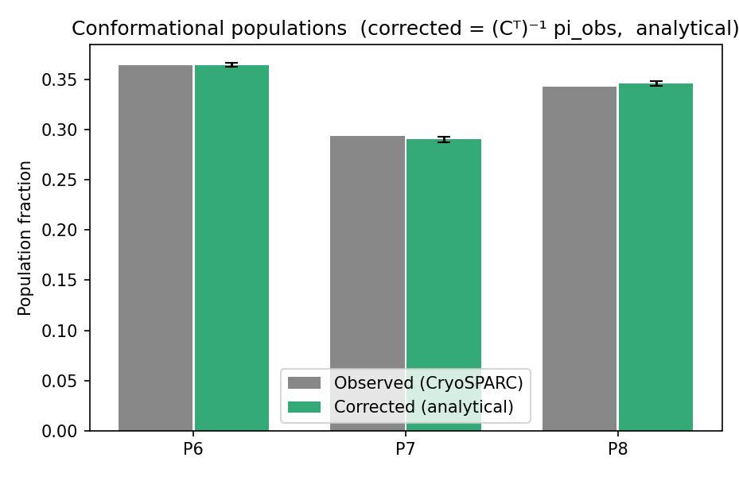

**J1442 — summary class table:**
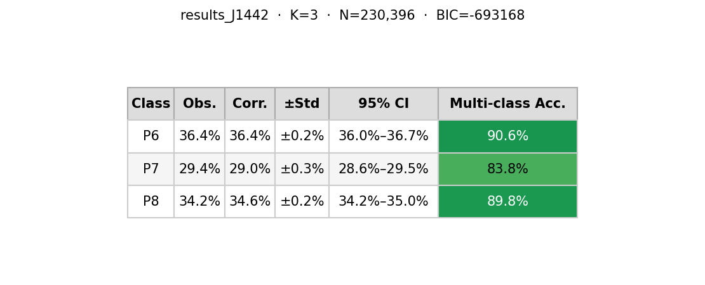

**J1497 — conformational populations bar chart:**
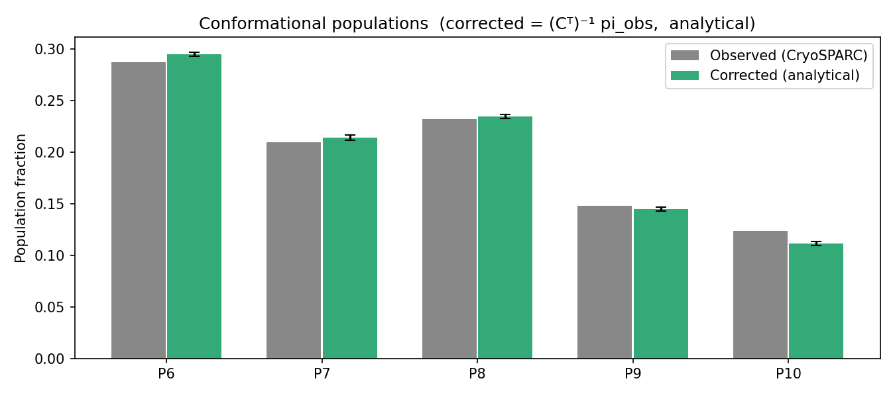

**J1497 — summary class table:**
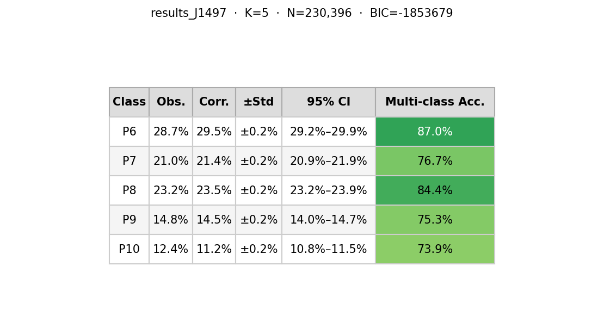

The summary table columns are: class label, N particles observed, π_obs (CryoSPARC hard fraction), π_corr ± std (corrected ± bootstrap std), 95% CI bounds, analytical confusion accuracy (green ≥ 80%, orange ≥ 60%, red < 60%), and Bhattacharyya overlap vs each other class (blue = low = good, red = high = bad).

### Comparison: old (buggy) vs new (fixed) bootstrap

| Class | Old ±std (MC GMM-refit) | New ±std (analytical no-refit) |
|-------|------------------------|-------------------------------|
| J1442 P6 | ±0.9% | ±0.2% |
| J1442 P7 | ±0.9% | ±0.3% |
| J1442 P8 | ±1.2% | ±0.2% |
| J1497 P6 | ±12.4% | ±0.2% |
| J1497 P7 | ±12.1% | ±0.2% |
| J1497 P8 | ±12.6% | ±0.2% |
| J1497 P9 | ±10.1% | ±0.2% |
| J1497 P10 | ±10.2% | ±0.2% |

The old J1442 bars (±0.9%) happened to be small by coincidence — with K=3 there are only 6 permutations and the warm-start kept most replicates aligned. At K=5 (120 permutations) the problem became visible.

---

## 8. Step 7 — GMM Stability (Repetition Test)

### What this measures
We run the GMM fitting 4 separate times (r=0 through r=3), each time using a slightly different random state, and look at whether the same class assignments are recovered. If the populations are very different between runs, the solution is unstable.

**Library used:** `scikit-learn` (`GaussianMixture` with different `random_state` seeds).

**J1442 repetition — population fraction across 4 runs:**

| Run | P6    | P7    | P8    |
|-----|-------|-------|-------|
| r=0 | 32.6% | 56.1% | 11.4% |
| r=1 | 29.2% | 49.3% | 21.5% |
| r=2 | 34.5% | 19.9% | 45.6% |
| r=3 | 35.3% | 29.4% | 35.3% |

**J1497 repetition — population fraction across 4 runs:**

| Run | P6    | P7    | P8    | P9    | P10   |
|-----|-------|-------|-------|-------|-------|
| r=0 | 51.6% | 9.6%  | 9.8%  | 29.0% | 0.0%  |
| r=1 | 33.8% | 33.1% | 23.9% | 9.2%  | 0.0%  |
| r=2 | 36.3% | 33.8% | 29.9% | 0.0%  | 0.0%  |
| r=3 | 36.5% | 17.9% | 21.4% | 19.1% | 5.0%  |

**What this means:** The J1442 GMM is moderately unstable — the P7 weight swings from 20% to 56% across runs. The J1497 GMM is highly unstable — P10 collapses to 0% in three of four runs, and P9 oscillates wildly. This confirms that the conformational landscape is flat: the GMM is finding local optima in a near-featureless space, and different random starts lead to very different partitions.

**J1442 — repetition / stability plot:**
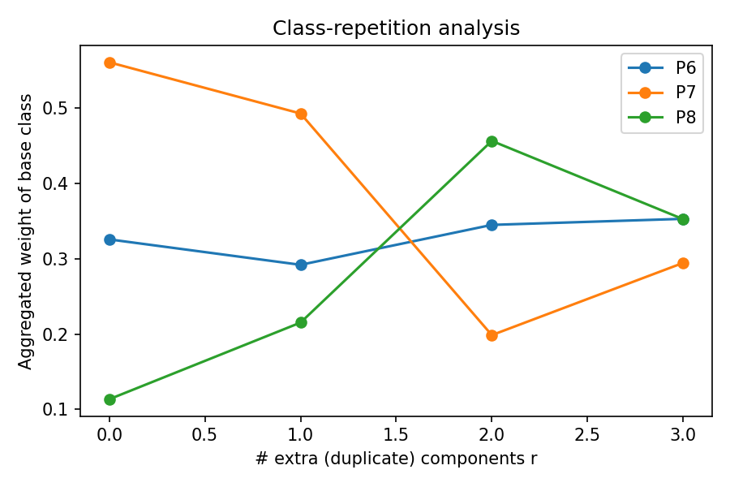

**J1497 — repetition / stability plot:**
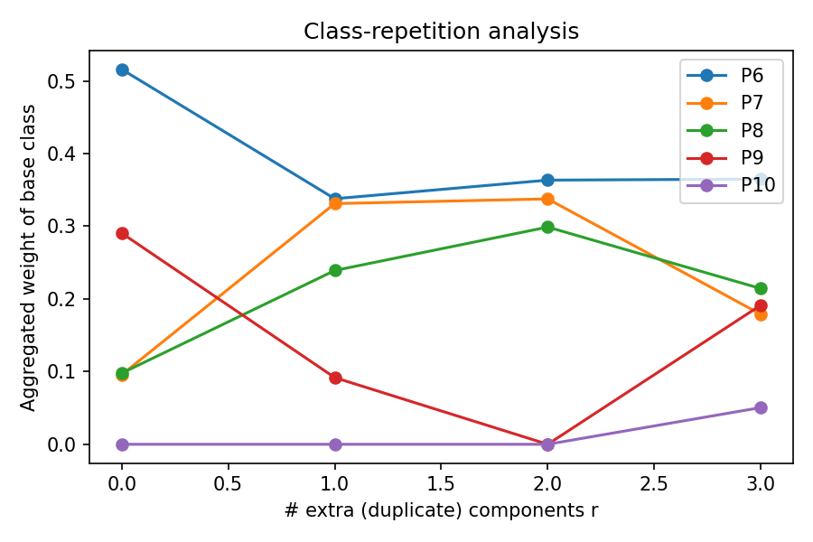

---

## 9. Low-Uncertainty Particle Sets (Exportable to CryoSPARC)

### What these are
Even though the overall population is poorly separated, there is a subset of particles that the GMM assigns with high confidence (GMM responsibility > 0.90). These are the particles that sit clearly inside one GMM cluster rather than on the boundaries. We export these as CryoSPARC-format `.cs` files for each class.

| Dataset | Total particles | Low-unc selected | Selection rate |
|---------|----------------|-----------------|----------------|
| J1442   | 230,396 | 81,483 | 35.4% |
| J1497   | 230,396 | 57,478 | 24.9% |

**J1442 per class:**
| Class | Low-unc particles |
|-------|-------------------|
| P6    | 13,211 |
| P7    | 65,008 |
| P8    | 3,264  |

**J1497 per class:**
| Class | Low-unc particles |
|-------|-------------------|
| P6    | 27,758 |
| P7    | 5,478  |
| P8    | 15,925 |
| P9    | 3,023  |
| P10   | 5,294  |

These files can be imported back into CryoSPARC for targeted refinements or for visualising which particles the GMM is most certain about.

---

## 10. Guide to Figures

All figures are embedded inline above in the relevant analysis sections. The files are saved in `results_J1442/`, `results_J1497/`, and `diagnostics/`. Additional diagnostic figures (posterior histograms, violin plots, entropy plots, stacked bar charts) are in `diagnostics/` but not reproduced here.

---

## 11. Predicted Sources of Error

### a) Flat CryoSPARC posteriors — signal is real but noisy per particle
The CryoSPARC posteriors are near-uniform per particle (mean max = 0.362 vs floor 0.333). This is a geometric consequence of the simplex constraint, not a failure of the refinement — John Hunt confirmed it matches expectations. The conformational signal exists at the population level (3–5σ mean separation between classes) but individual particle assignments are inherently ambiguous. Every downstream analysis inherits this noise, but the population-level results remain robust.

### b) GMM instability from flat posterior space
When the ALR-transformed data cluster tightly near the origin, the GMM is fitting K blobs to a nearly spherical cloud. The solution depends on initialisation, which is why the repetition test shows variation. This is expected given the data; it is not a flaw in the method.

### c) Confusion matrix inversion — mild amplification
Inverting Cᵀ amplifies small estimation errors by an amount related to the condition number of the confusion matrix. For K=3 with 90% diagonals, this amplification is negligible and the ±0.2% bootstrap std is genuine. For K=5 with 74–87% diagonals, the amplification is slightly larger but still well-controlled after the bootstrap fix.

### d) Label-switching in bootstrap (fixed)
The original bootstrap refitted the GMM on each resample, causing the GMM to number its K components arbitrarily on each replicate. This label-switching scrambled the MC confusion rows relative to CryoSPARC's P6/P7/P8 labels, making corrected population estimates meaningless and inflating J1497 error bars to ±12%. **This bug has been fixed**: the bootstrap now resamples only particles, recomputes the analytical confusion (which uses CryoSPARC's fixed labels), and never refits the GMM. The MC bootstrap and empirical confusion matrix outputs are retained in the CSV for diagnostic comparison but are not used for any reported results.

### e) 6 dummy classes vs. protein signal
The 6 dummy (decoy) classes absorb junk particles. We discard them and renormalize, which is correct. However, if protein signal is weak, some genuine protein particles may be pulled into dummy classes during CryoSPARC refinement, slightly reducing effective protein particle count.

### f) Score-space Gaussian assumption
The analytical confusion matrix assumes that the per-class distribution of CryoSPARC posterior vectors is well-approximated by a multivariate Gaussian. In practice, the simplex constraint makes these distributions bounded and slightly skewed. John Hunt noted the distributions are "not exactly Gaussian but close enough." The ALR transform largely corrects this (it maps the simplex to unconstrained space where Gaussians are more appropriate), but residual non-Gaussianity in the posterior space is a systematic uncertainty not captured by the bootstrap.

---

## 12. Possible Next Steps

### Immediate (can be done now)
1. **Use the low-uncertainty particle sets for targeted refinements.** For J1442, 65k P7 particles and 13k P6 particles have >90% GMM confidence. Running CryoSPARC homogeneous refinement on just those particles, without the uncertain ones, may sharpen the map for those classes.
2. **Run posterior diagnostics** (see `posterior_diagnostics.py` figures) — these directly visualise how flat the CryoSPARC posteriors are and should accompany any discussion of why classification is hard.

### Data improvement
3. **Collect more particles.** With near-uniform posteriors, the signal-to-noise ratio in the class-distinguishing information is very low. More particles = better averaging of that weak signal.
4. **Use focused classification / signal subtraction.** If the conformational differences are localised to a specific region of the protein, masking out the rest of the density and reclassifying on the masked region can dramatically improve class separation.
5. **Try per-particle CTF refinement** before classification. Better CTF correction improves the high-resolution signal and can help distinguish conformations.

### Analysis improvement
6. **Fit a GMM on 3D volume coefficients** instead of 2D posterior probabilities. If PCA or cryoDRGN latent coordinates are available for these data, those are better inputs to the GMM because they encode 3D structural information directly rather than going through CryoSPARC's noisy 2D-to-class posterior mapping.
7. **Try cryoDRGN or 3DFlex** for continuous conformational heterogeneity. These methods model the conformational landscape without pre-committing to K discrete classes, which is more appropriate if the protein moves continuously between states.
8. **Reduce the number of classes.** The J1497 5-class GMM is clearly unstable (P10 collapses to 0 in 3 of 4 runs). A 3-class model on J1497 data might give a more stable and interpretable result.

---

## 13. Software Stack Summary

| Library | Version used | Role |
|---------|-------------|------|
| `numpy` | — | Loading `.cs` files, array operations, ALR transform, matrix inversion, bootstrap resampling |
| `scipy` | — | `scipy.special.erf` (analytical confusion integrals), `scipy.optimize.linear_sum_assignment` (Hungarian algorithm for bootstrap class matching) |
| `scikit-learn` | — | `GaussianMixture` (GMM fitting and responsibilities) |
| `matplotlib` | — | All figures and tables |
| `pandas` | — | CSV I/O for results files |

All code is in the `gmm_pipeline/` package and `run_pipeline.py` entry point.

---

*This report was generated from results in `results_J1442/` and `results_J1497/`. All figures referenced are saved in those directories.*
