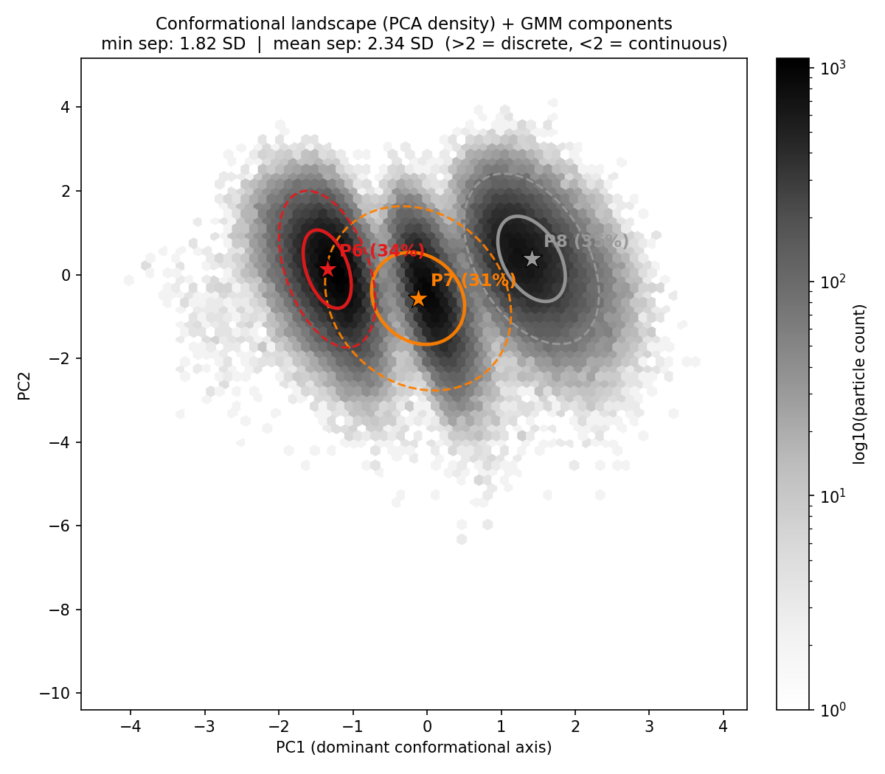
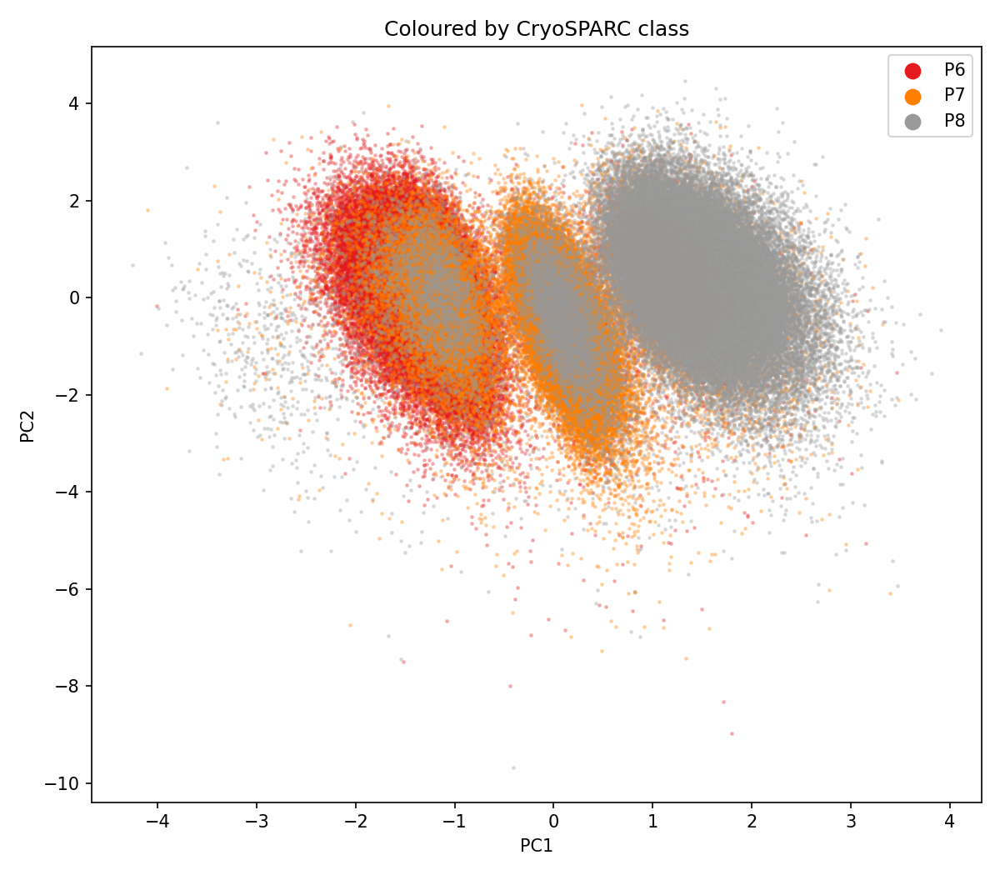
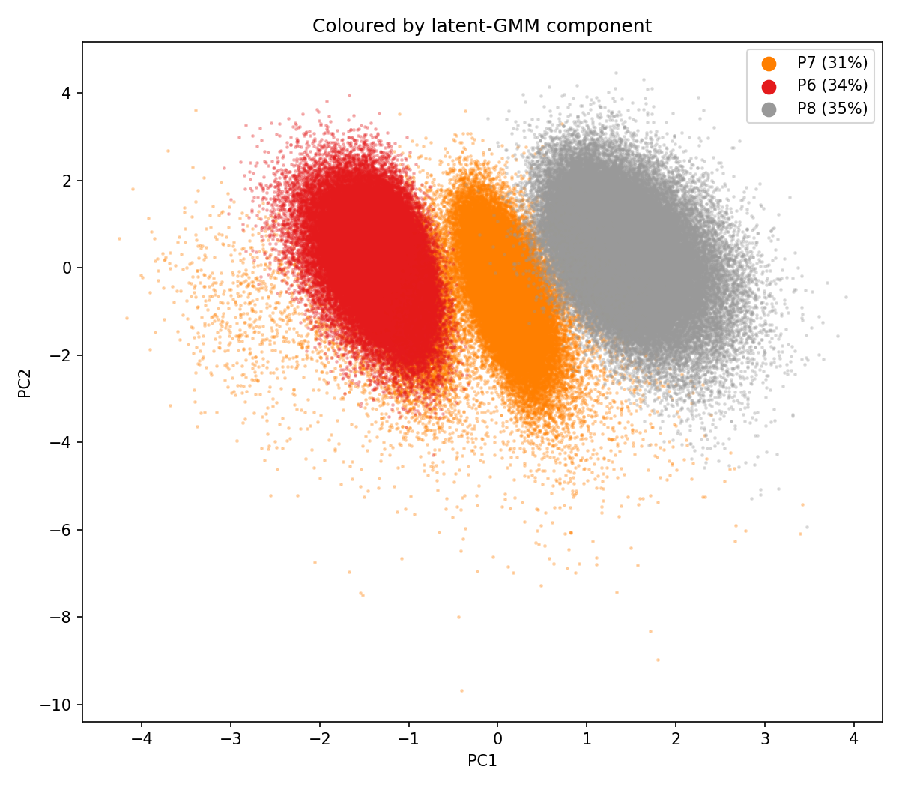
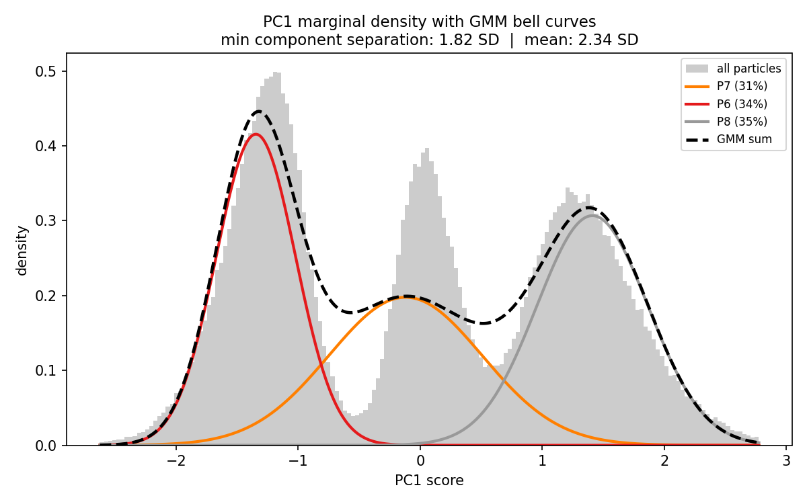
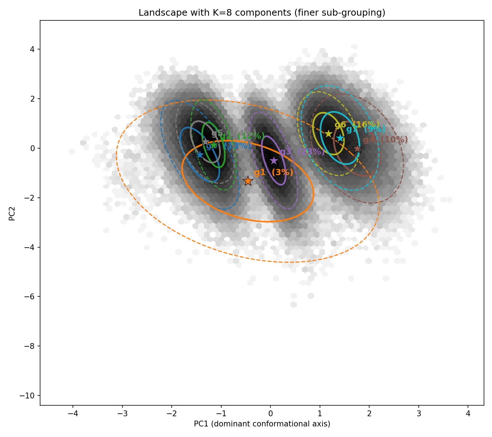

# cryoDRGN Analysis: J1442 CFTR Conformational Landscape

**Dataset:** J1442 (3-class heterogeneous refinement, P6/P7/P8)  
**Particles:** 230,396 protein-only  
**Training:** zdim=10, 100 epochs, D=128, GPU (hudson)  
**Model:** `results_cryodrgn/J1442_real/train_z10/`

---

## Background: What cryoDRGN Does (and How It Differs from CryoSPARC)

**CryoSPARC 3D classification** is told K=3 upfront and explicitly optimizes to partition particles into 3 classes. Its posteriors reflect that prior — they are sharpened toward K discrete bins.

**cryoDRGN** is told nothing about classes. It trains a variational autoencoder (VAE) that learns a continuous *latent coordinate* z for each particle purely from the images. No K, no class labels. After training, we apply a GMM to the latent space post-hoc to see what structure is there.

**The key result:** cryoDRGN — without any prior knowledge of the classification — independently recovers the same dominant conformational axis as CryoSPARC. This validates the P6/P7/P8 split as a real signal in the images, not an artifact of CryoSPARC's prior.

---

## Training Convergence

Loss was flat from epoch 10 onward (0.5595 → 0.5588, < 0.1% change over 90 epochs). The result is fully converged — not an undertraining artifact.

| Epoch | Gen loss | KLD |
|---|---|---|
| 1 | 0.5624 | 7.8 |
| 10 | 0.5595 | 18.0 |
| 50 | 0.5588 | 19.7 |
| 100 | 0.5586 | 20.2 |

---

## Conformational Landscape Figures

All figures: `landscape_z10/`

### Panel A: PCA Density + GMM Ellipses



The 10-D latent space is projected onto its top 2 PCA axes (PC1=15.5%, PC2=11.9% of variance).
Grey shading = particle density (log scale). Colored ellipses = the three GMM components
projected into this plane (1σ solid, 2σ dashed). Stars = component centers.

The ellipses are mathematically exact projections of the multidimensional Gaussians —
not just visual overlays. A 2-D Gaussian under a linear projection (PCA) stays Gaussian.

**Min separation: 1.82 SD | Mean separation: 2.34 SD** (threshold for "discrete" = 2 SD)

---

### Panel B: Colored by CryoSPARC Class



Each dot is a particle, colored by its CryoSPARC hard class assignment. P6 (red), P7 (orange),
P8 (grey) separate along PC1 — confirming that the dominant latent axis *is* the CryoSPARC
P6→P7→P8 conformational axis, recovered without labels.

---

### Panel C: Colored by cryoDRGN-GMM Component



Same plane, colored by the latent-GMM hard assignment. Compare to Panel B — the two
colorings are 81% identical, confirming that the two methods agree on class identity
for most particles.

---

### Panel D: PC1 Marginal Density (Bell Curves)



The landscape collapsed to 1D along the dominant axis. The grey histogram shows the
raw particle density — **three clear peaks** at PC1 ≈ −1.3, 0, +1.3. The colored
curves are each GMM component's bell curve projected onto PC1 (honest 1-D shadow of
each 10-D Gaussian). The black dashed curve is the model sum.

**Reading the orange (P7) bell curve:** P7 is the middle/bridge state between P6 and
P8. Its bell curve is wider than the other two because the P7 component's covariance
is larger along PC1 — it straddles the transition region between the two flanking states.
This is physically correct, not a bug. A narrow P7 curve would mean P7 particles
cluster tightly to one spot, which they don't.

**What this panel answers:** The density is clearly tri-modal (three peaks), not a
single featureless blob. But the peaks are connected by populated valleys (they don't
drop to zero), meaning the three states share intermediate particles. This is the
picture of three **preferred conformations** along a continuous path, not three
rigidly isolated species.

---

### Fine Sub-grouping (K=8)



Forcing K=8 reveals whether there are hidden sub-states beyond the three main classes.
The 8 ellipses tile the **same three** density peaks — no hidden 4th or 5th state.
This confirms K=3 is the natural number of preferred states in this dataset.

---

## Population Estimates

| Class | CryoSPARC soft | cryoDRGN corrected (95% CI) | cryoDRGN hard count |
|---|---|---|---|
| P6 | 33.1% | **36.5%** [36.3, 36.7] | 92,453 (40.1%) |
| P7 | 33.7% | **29.3%** [29.1, 29.5] | 54,371 (23.6%) |
| P8 | 33.2% | **34.3%** [34.1, 34.5] | 83,572 (36.3%) |

The "corrected" estimates use the soft GMM posteriors de-biased by the confusion matrix
(same approach as the original gmm_pipeline). The tight CIs (< 0.5% width) come from
a 500-replicate particle bootstrap.

**Reproducibility across runs:** The corrected populations were **identical within 0.1%**
between the z=8/50-epoch run and the z=10/100-epoch run, confirming the fractions are
data-driven and not sensitive to model hyperparameters.

---

## Agreement Metrics (cryoDRGN vs CryoSPARC)

| Metric | Value |
|---|---|
| Hard class agreement | 81.4% |
| ARI (cryoDRGN GMM vs CryoSPARC) | 0.543 |
| AMI / NMI | 0.469 |
| Canonical correlation (z vs posterior) | 0.781 (axis 1), 0.348 (axis 2) |
| Mean JS divergence | 0.299 nats (bound ln2 = 0.693) |

The first canonical correlation (0.78) means one strong axis of the latent z space
aligns with the CryoSPARC classification. The second (0.35) is a weaker secondary
signal. This confirms cryoDRGN learned the same dominant conformational coordinate.

---

## Where the Peak Volumes Come From

The `eval_vol` command decodes z-vectors through the **cryoDRGN decoder** (a neural
network trained to map latent z → 3D Fourier coefficients → 3D volume). It does not
average raw particle images. Instead, it asks: "given this position in latent space,
what 3D structure does the model predict?"

The three z-vectors in `landscape_z10/z_gmm_peaks.txt` are the **GMM component means** —
the center of each preferred state in the 10-D latent space. Decoding these gives the
model's best guess for the structure at each conformational minimum.

**Run on hudson (GPU):**
```bash
cryodrgn eval_vol results_cryodrgn/J1442_real/train_z10/weights.pkl \
  --config results_cryodrgn/J1442_real/train_z10/config.yaml \
  --zfile results_cryodrgn/J1442_real/landscape_z10/z_gmm_peaks.txt \
  --Apix 0.83 \
  -o results_cryodrgn/J1442_real/landscape_z10/peak_volumes
```
Output: `vol_000.mrc` (P7 center), `vol_001.mrc` (P6 center), `vol_002.mrc` (P8 center).

---

## Particle Subsets for CryoSPARC Refinement

**Script:** `scripts/cryodrgn/export_cryodrgn_subsets.py`  
**Output:** `results_cryodrgn/J1442_real/cryodrgn_subsets/`

| File | N particles | Description |
|---|---|---|
| `cryodrgn_class_P6.cs` | 92,453 | All cryoDRGN latent-GMM P6 assignments |
| `cryodrgn_class_P7.cs` | 54,371 | All cryoDRGN latent-GMM P7 assignments |
| `cryodrgn_class_P8.cs` | 83,572 | All cryoDRGN latent-GMM P8 assignments |
| `cryodrgn_class_P6_hc.cs` | 26,203 | High-confidence P6 (agree + low JS) |
| `cryodrgn_class_P7_hc.cs` | 15,573 | High-confidence P7 (agree + low JS) |
| `cryodrgn_class_P8_hc.cs` | 31,211 | High-confidence P8 (agree + low JS) |

High-confidence = CryoSPARC hard class matches cryoDRGN hard class (`agree==1`) **AND**
JS divergence < 33rd percentile (0.294 nats) — the bottom third of divergences, where
the two methods' soft posteriors are most similar.

**CryoSPARC workflow for each file:**
1. Import Particles → select the `.cs` file
2. Ab-initio Reconstruction (K=1)
3. NU-Refinement using the ab-initio map

---

## Recommended downstream analyses

**1. Ab-initio + NU on all cryoDRGN classes**  
Run ab-initio + NU-refinement on the 3 full-class `.cs` files. This gives maps defined
by cryoDRGN's classification — compare them to the original CryoSPARC P6/P7/P8 maps
to see whether the different particle assignment (~19% of particles reassigned) produces
structurally different maps.

**2. NU on high-confidence subsets**  
Run NU-refinement on the 3 `_hc.cs` files. Fewer particles but purer signal — expected
to give sharper maps by removing the borderline/ambiguous particles from each class.

**3. Peak volumes from cryoDRGN decoder** *(cluster GPU required)*  
Run `eval_vol` with `z_gmm_peaks.txt` to get the three decoder-predicted structures.
Compare to the refined maps as a sanity check that the decoder learned real density.

**4. Pull results and compare maps**  
Once refinements complete, pull all maps and overlay in ChimeraX alongside the
landscape figures to produce the conformational trajectory figure.

---

## Run Commands Reference

```bash
# Export particle subsets (local, cryodrgn-py310)
python scripts/cryodrgn/export_cryodrgn_subsets.py \
  --npz results_cryodrgn/J1442_real/latent_gmm_z10/per_particle.npz \
  --passthrough-cs data/cryosparc_P25_J1442_passthrough_particles_all_classes.cs \
  --protein-idx 6 7 8 --js-pct 33 \
  -o results_cryodrgn/J1442_real/cryodrgn_subsets

# Decode peak volumes (cluster)
cryodrgn eval_vol results_cryodrgn/J1442_real/train_z10/weights.pkl \
  --config results_cryodrgn/J1442_real/train_z10/config.yaml \
  --zfile results_cryodrgn/J1442_real/landscape_z10/z_gmm_peaks.txt \
  --Apix 0.83 \
  -o results_cryodrgn/J1442_real/landscape_z10/peak_volumes

# Re-run landscape visualization
python scripts/cryodrgn/cryodrgn_landscape.py \
  --z results_cryodrgn/J1442_real/train_z10/z.100.pkl \
  --passthrough-cs data/cryosparc_P25_J1442_passthrough_particles_all_classes.cs \
  --cs data/cryosparc_P25_J1442_00000_particles.cs \
  --n-dummies 6 --protein-idx 6 7 8 -k 3 --k-fine 8 \
  -o results_cryodrgn/J1442_real/landscape_z10

# Re-run latent GMM analysis
python scripts/cryodrgn/cryodrgn_latent_gmm.py \
  --z results_cryodrgn/J1442_real/train_z10/z.100.pkl \
  --passthrough-cs data/cryosparc_P25_J1442_passthrough_particles_all_classes.cs \
  --cs data/cryosparc_P25_J1442_00000_particles.cs \
  --n-dummies 6 --protein-idx 6 7 8 -k 3 --k-max 8 --n-boot 500 --seed 0 \
  -o results_cryodrgn/J1442_real/latent_gmm_z10
```
